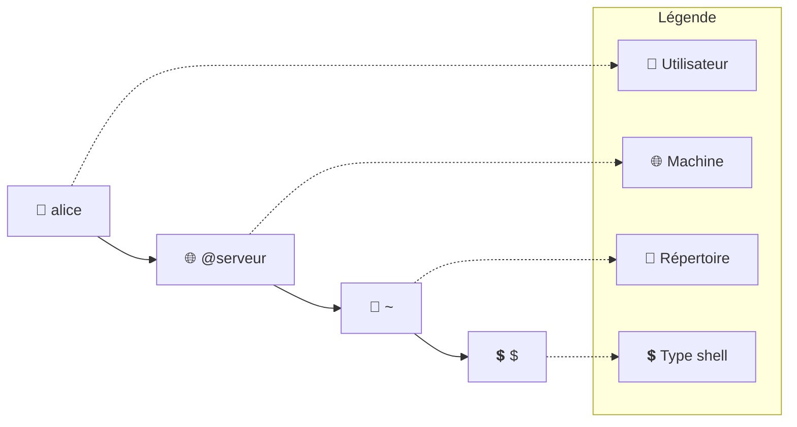
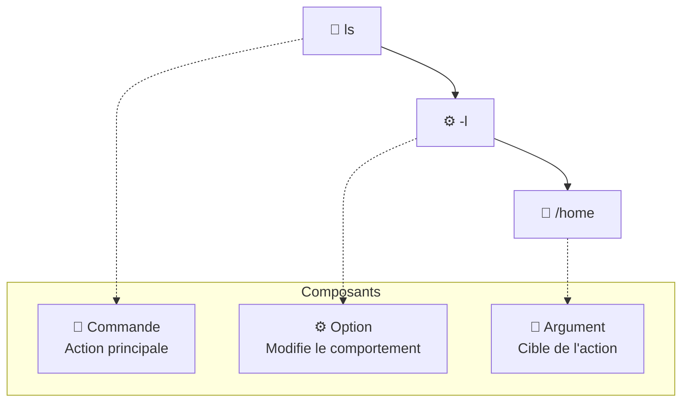
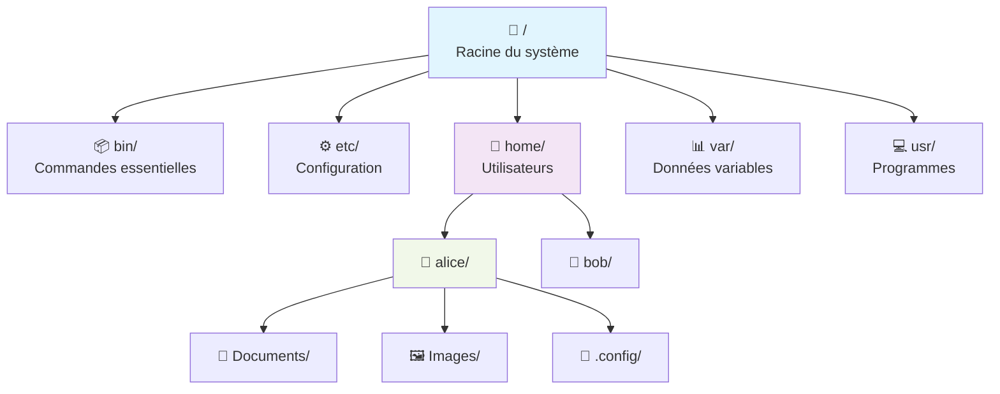
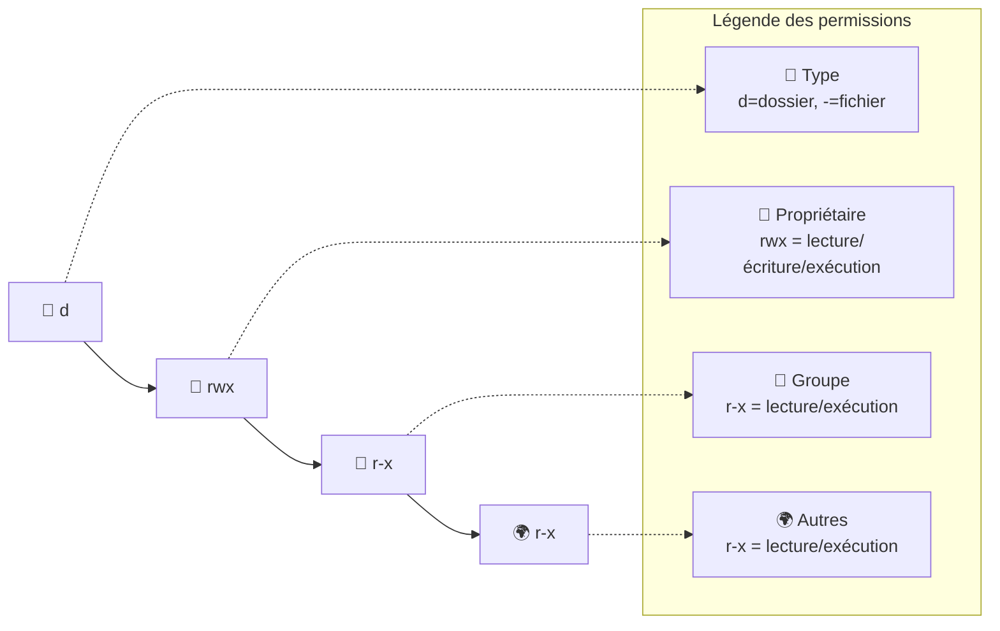
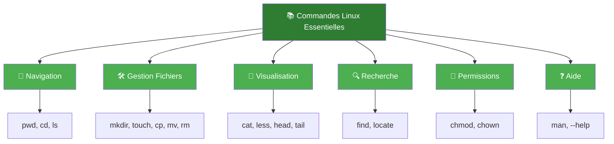
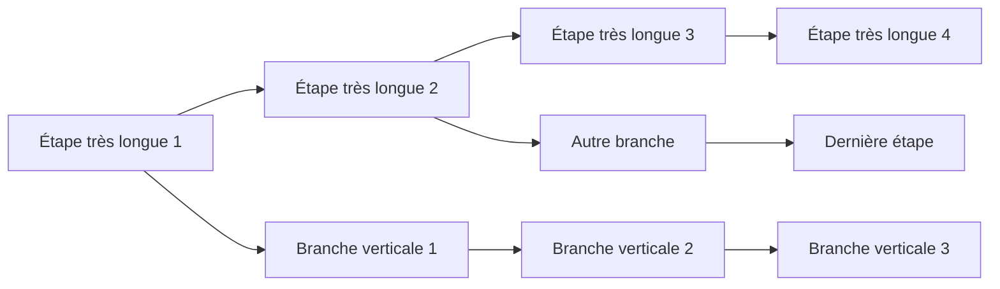

# 🐧 Introduction à Linux

## Qu'est-ce qu'un Shell ?

Le **shell** est un programme qui sert d'interface entre l'utilisateur et le système d'exploitation. C'est votre point d'entrée pour communiquer avec la machine.

**Analogies :**
- 🖥️ **Interface graphique** → Souris et fenêtres
- ⌨️ **Shell** → Clavier et commandes texte

## Les Différents Types de Shell

| Shell | Nom Complet | Particularités |
|-------|-------------|----------------|
| **Bash** | Bourne Again SHell | Shell par défaut sur la plupart des Linux |
| **Zsh** | Z Shell | Shell moderne avec autocomplétion avancée |
| **Fish** | Friendly Interactive SHell | Interface conviviale et colorée |
| **csh/tcsh** | C SHell | Syntaxe inspirée du langage C |

> 💡 **Dans ce cours, nous utiliserons exclusivement Bash**

---

# 🎯 L'Invite de Commande (Prompt)

## Comprendre le Prompt
```bash
utilisateur@nom_machine[~]$ 
```

**Exemples concrets :**

* Utilisateur normal :
```bash
alice@serveur:~$ 
```

* Super-utilisateur (root) :
```bash
root@kali:~# 
```

## Décryptage du Prompt





**Signification des symboles :**
- `~` : Répertoire personnel de l'utilisateur
- `$` : Shell utilisateur normal
- `#` : Shell administrateur (root)

---

# 🏗️ Structure d'une Commande Linux

## Anatomie d'une Commande

```bash
commande [options] [arguments]
```

**Exemple détaillé :**
```bash
ls -l /home
```



## Règles de Syntaxe

- **Sensible à la casse** : `File` ≠ `file`
- **Espaces** : Séparent les éléments
- **Guillemets** : Pour les noms avec espaces

---

# ❓ Obtenir de l'Aide

## Méthodes d'Aide Intégrées

### 1. `--help` - Aide rapide
```bash
ls --help
```
*Affiche un résumé des options disponibles*

### 2. `man` - Manuel complet
```bash
man ls
```
*Documentation détaillée avec exemples*

### 3. `info` - Documentation alternative
```bash
info ls
```
*Version hypertexte de la documentation*

> 🚨 **Règle d'or** : Toujours consulter `--help` ou `man` avant de chercher sur Internet !

---

# 📁 Système de Fichiers Linux

## Concepts Fondamentaux

### Fichier
Collection organisée de données :
- 📄 Documents texte
- 🖼️ Images
- ⚙️ Programmes
- 🔧 Fichiers de configuration

### Répertoire (Dossier)
Conteneur qui organise les fichiers :
- 🗂️ Structure hiérarchique
- 📂 Peut contenir d'autres répertoires

## Arborescence Linux



---

# 🛠️ Commandes de Gestion des Fichiers

## 1. `mkdir` - Créer des Répertoires

**Syntaxe :**
```bash
mkdir [OPTIONS] RÉPERTOIRE...
```

**Exemples pratiques :**
```bash
# Création simple
mkdir projet_web

# Création récursive (arborescence complète)
mkdir -p site/{css,js,images/{icons,photos}}

# Création multiple
mkdir client1 client2 client3
```

**Résultat :**
```
site/
├── css/
├── js/
└── images/
    ├── icons/
    └── photos/
```

## 2. `touch` - Créer des Fichiers

**Fonctionnalités :**
- Crée un fichier vide s'il n'existe pas
- Met à jour la date de modification

**Utilisation :**
```bash
# Création simple
touch index.html

# Création multiple
touch style.css script.js readme.md

# Avec contenu initial
echo "Hello World" > welcome.txt
```

## 3. `rm` - Supprimer Fichiers et Répertoires

**⚠️ ATTENTION : Suppression DÉFINITIVE !**

**Options principales :**
```bash
rm fichier.txt              # Fichier simple
rm -r dossier/              # Dossier récursif
rm -i *.tmp                 # Confirmation interactive
```

**⛔ COMMANDE DANGEREUSE :**
```bash
rm -rf /   # DÉTRUIT TOUT LE SYSTÈME !
```

**Bonnes pratiques :**
```bash
# TOUJOURS vérifier avant de supprimer
ls
rm -i fichier_douteux.txt
```

## 4. `cp` - Copier des Éléments

**Syntaxes courantes :**
```bash
# Copie simple
cp source.txt destination.txt

# Copie avec vérification
cp -i important.txt backup/

# Copie récursive de dossier
cp -r ancien_projet/ nouveau_projet/

# Copie multiple
cp *.jpg photos/
```

## 5. `mv` - Déplacer et Renommer

**Deux utilisations :**

1. **Renommage :**
```bash
mv ancien_nom nouveau_nom
```

2. **Déplacement :**
```bash
mv fichier.txt Documents/
mv *.log archives/
```

**Option de sécurité :**
```bash
mv -i fichier.txt existant.txt  # Demande confirmation
```

---

# 👀 Commandes de Visualisation

## 1. `ls` - Lister le Contenu

**Options essentielles :**
```bash
ls          # Liste basique
ls -l       # Format long avec détails
ls -a       # Affiche les fichiers cachés
ls -la      # Combinaison des deux
ls -lh      # Tailles lisibles
ls -t       # Tri par date
```

**Exemple de sortie détaillée :**
```bash
$ ls -la
total 48
drwxr-xr-x  5 alice alice  4096 Dec 15 10:30 .
drwxr-xr-x 18 alice alice  4096 Dec 14 09:15 ..
-rw-r--r--  1 alice alice   220 Dec 15 10:25 .bashrc
-rw-r--r--  1 alice alice  1024 Dec 15 10:28 document.txt
drwxr-xr-x  2 alice alice  4096 Dec 15 10:30 Images
```

## 2. `cat` - Afficher le Contenu

**Utilisations :**
```bash
cat fichier.txt              # Contenu complet
cat -n script.js             # Avec numéros de ligne
cat fichier1.txt fichier2.txt # Concaténation
```

## 3. `less` - Navigation Avancée

**Commandes dans `less` :**
- `Espace` : Page suivante
- `b` : Page précédente
- `/motif` : Rechercher
- `n` : Occurrence suivante
- `q` : Quitter

## 4. `head` / `tail` - Extrémités

```bash
head -20 fichier.log     # 20 premières lignes
tail -15 fichier.log     # 15 dernières lignes
tail -f application.log  # Suivi en temps réel
```

---

# 🧭 Navigation dans le Système

## Types de Chemins

### Chemin Absolu
Commence toujours par `/`
```bash
/home/alice/Documents/rapport.txt
```

### Chemin Relatif
Dépend de la position actuelle
```bash
Documents/rapport.txt
../Images/photo.jpg
```

## Commandes de Navigation

### `pwd` - Savoir où on est
```bash
pwd
# /home/alice/Documents/Projets
```

### `cd` - Se Déplacer

**Raccourcis essentiels :**
```bash
cd                    # Retour au répertoire personnel
cd /chemin/absolu     # Navigation absolue
cd dossier/enfant     # Navigation relative
cd ..                 # Remonter d'un niveau
cd ../..              # Remonter de deux niveaux
cd -                  # Retour au répertoire précédent
```

**Exemple pratique :**
```bash
$ pwd
/home/alice
$ cd Documents/Projets
$ pwd
/home/alice/Documents/Projets
$ cd ../..
$ pwd
/home/alice
$ cd -
/home/alice/Documents/Projets
```

---

# 🗂️ Arborescence Linux Standard

## Répertoires Système Importants

| Répertoire | Rôle | Exemple de Contenu |
|------------|------|-------------------|
| `/` | Racine du système | Point de départ de tout |
| `/home` | Répertoires utilisateurs | `/home/alice`, `/home/bob` |
| `/etc` | Fichiers de configuration | `passwd`, `hosts`, réseaux |
| `/var` | Données variables | Logs, bases de données |
| `/tmp` | Fichiers temporaires | Fichiers éphémères |
| `/bin` | Commandes essentielles | `ls`, `cp`, `mv`, `rm` |
| `/usr` | Programmes utilisateur | Applications installées |
| `/dev` | Périphériques | Disques, clés USB |
| `/boot` | Démarrage | Noyau, initramfs |

---

# 🔍 Recherche de Fichiers

## 1. `find` - Recherche Puissante

**Recherche par nom :**
```bash
find . -name "*.txt"              # Fichiers .txt
find /home -name "config*"        # Commençant par "config"
```

**Recherche par type :**
```bash
find . -type f                    # Fichiers seulement
find . -type d                    # Dossiers seulement
```

**Recherche par taille :**
```bash
find . -size +10M                 # > 10 Mo
find . -size -100k                # < 100 Ko
```

**Recherche par utilisateur :**
```bash
find . -user alice                # Appartenant à alice
```

## 2. `locate` - Recherche Rapide

**Avantage :** Très rapide (base de données)
**Inconvénient :** Ne voit pas les nouveaux fichiers

```bash
locate .bashrc
sudo updatedb                    # Met à jour la base
```

---

# 🔐 Système de Permissions Linux

## Structure des Permissions

**Format :** `drwxr-xr-x`



**Types de fichiers :**
- `-` : Fichier régulier
- `d` : Répertoire (dossier)
- `l` : Lien symbolique

## Commandes de Gestion des Permissions

### `chmod` - Modifier les Permissions

**Syntaxe symbolique :**
```bash
chmod u+x script.sh        # +x pour l'utilisateur
chmod g-w document.txt     # -w pour le groupe
chmod o+r public.pdf       # +r pour les autres
```

**Syntaxe octale :**
```bash
chmod 644 fichier.txt      # rw-r--r--
chmod 755 script.sh        # rwxr-xr-x
chmod 600 secret.txt       # rw-------
```

**Table de conversion :**

| Octal | Symbolique | Signification |
|-------|------------|---------------|
| 7 | rwx | Lecture + Écriture + Exécution |
| 6 | rw- | Lecture + Écriture |
| 5 | r-x | Lecture + Exécution |
| 4 | r-- | Lecture seule |
| 0 | --- | Aucun droit |

### `chown` - Changer le Propriétaire

```bash
sudo chown alice:developers script.sh
sudo chown -R www-data:www-data /var/www/
```

---

# 💻 Exercices Pratiques

## 🎯 Exercice 1 : Exploration de Base

```bash
# Découvrez votre environnement
whoami
pwd
ls -la
ls -l /home
```

## 🎯 Exercice 2 : Création d'Arborescence

```bash
# Créez une structure de projet web complète
mkdir -p MonSite/{html,css,js,assets/{images,icons}}
touch MonSite/html/index.html
touch MonSite/css/style.css
touch MonSite/js/script.js

# Vérification
ls -R MonSite/
```

## 🎯 Exercice 3 : Gestion des Permissions

```bash
# Créez et testez différentes permissions
touch secret.txt public.txt script.sh

chmod 600 secret.txt    # Privé (rw-------)
chmod 644 public.txt    # Public lecture (rw-r--r--)
chmod 755 script.sh     # Exécutable (rwxr-xr-x)

# Vérification
ls -l
```

## 🎯 Exercice 4 : Recherche Avancée

```bash
# Trouvez tous les fichiers .conf dans /etc
find /etc -name "*.conf" | head -10

# Fichiers modifiés aujourd'hui
find . -mtime -1

# Fichiers vous appartenant
find ~ -user $(whoami) | wc -l
```

---

# ⚡ Trucs et Astuces Productivité

## Autocomplétion
- `Tab` : Complète automatiquement
- `Tab Tab` : Montre les possibilités

## Historique des Commandes
```bash
history           # Voir l'historique
!123              # Exécuter la commande #123
!!                # Répéter la dernière commande
!ls               # Dernière commande ls
```

## Jokers (Wildcards)
```bash
*.txt             # Tous les fichiers .txt
file?.txt         # file1.txt, file2.txt, etc.
[abc]*            # Commençant par a, b ou c
{jan,feb}*.log    # Fichiers de janvier et février
```

## Raccourcis Clavier
- `Ctrl + C` : Interrompre une commande
- `Ctrl + D` : Se déconnecter
- `Ctrl + L` : Effacer l'écran
- `Ctrl + R` : Recherche dans l'historique

---

# 📚 Résumé des Commandes Essentielles



## 🎓 Conseils pour Progresser

1. **Pratique quotidienne** : 10 minutes par jour
2. **Expérimentation** : Testez dans un environnement sûr
3. **Documentation** : Utilisez `man` avant Internet
4. **Bonnes pratiques** : Vérifiez toujours avant de supprimer

**✨ Le secret : La régularité prime sur la durée !**

> 💡 **Prochain cours** : Nous aborderons les redirections, les pipes et les scripts Bash !
<div class="mermaid-container">
<div class="mermaid">
flowchart LR
    A[👤 alice] --> B[🌐 @serveur] --> C[📁 ~] --> D[💲 $]
    
    subgraph Legend [Légende]
        L1[👤 Utilisateur]
        L2[🌐 Machine]
        L3[📁 Répertoire]
        L4[💲 Type shell]
    end
    
    A -.-> L1
    B -.-> L2
    C -.-> L3
    D -.-> L4
</div>
</div>

<div style="text-align: center; background: #1a1a1a; padding: 25px; border-radius: 10px; margin: 30px 0; border: 1px solid #333;">


</div>
<div class="mermaid-responsive">


</div>
