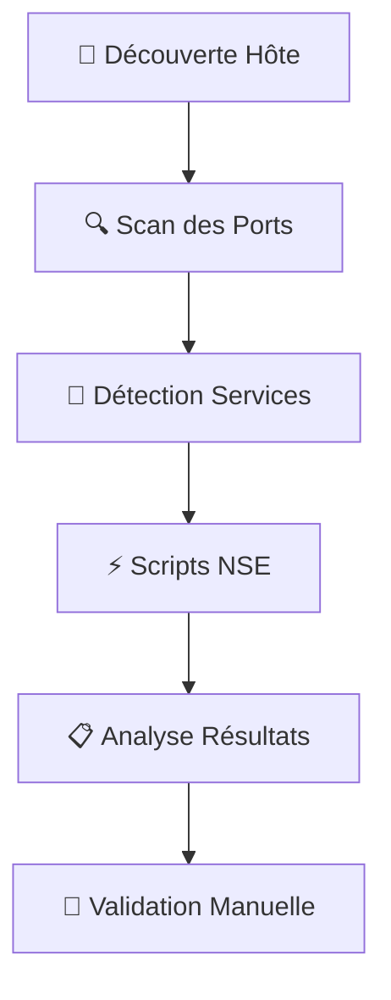

# 🕵️‍♂️ Énumération des Services avec Nmap : Guide Complet et Détaillé

## 📚 Introduction à l'Énumération Réseau

L'énumération réseau est une phase cruciale dans le processus de test d'intrusion et d'audit de sécurité. Elle consiste à **cartographier méthodiquement** les services, ports et systèmes accessibles sur un réseau cible. Cette étape permet d'identifier les **points d'entrée potentiels** et de comprendre l'architecture globale du système cible.

Nmap (Network Mapper) est l'outil de référence pour cette tâche, offrant une gamme complète de fonctionnalités pour la découverte d'hôtes, l'analyse de ports et la détection de services.

---

## 📊 Workflow d'Énumération Complète



**Explication du processus :**
Chaque étape construit sur la précédente, créant une approche systématique qui garantit qu'aucun détail important n'est négligé. La validation manuelle finale est particulièrement importante pour confirmer les résultats automatisés.

---

## 🔎 Nmap – Scans de Base

### 🚀 Scan Complet avec Détection de Versions

```bash
sudo nmap 10.129.2.28 -p- -sV
```

**Pourquoi utiliser cette commande ?**
Cette commande représente l'approche la plus complète pour l'énumération initiale. Elle scanne **tous les ports TCP** (65,535 ports) et tente d'identifier la version exacte de chaque service découvert. Cette information est cruciale pour la recherche ultérieure de vulnérabilités spécifiques.

**📋 Détail des Options Utilisées :**

| Option | Description Technique | Importance |
|--------|-------------|-------------------|
| `10.129.2.28` | Adresse IP de la cible | Cible spécifique à analyser |
| `-p-` | Scan de tous les ports (1-65535) | Évite de manquer des services sur des ports non standard |
| `-sV` | Détection approfondie des versions | Permet d'identifier les versions logicielles pour recherche de vulnérabilités |

**🎯 Exemple de Résultat Détaillé :**
```
PORT     STATE SERVICE     VERSION
22/tcp   open  ssh         OpenSSH 8.2p1 Ubuntu 4ubuntu0.3 (Ubuntu Linux; protocol 2.0)
80/tcp   open  http        Apache httpd 2.4.41 ((Ubuntu))
3306/tcp open  mysql       MySQL 8.0.25
```
*Analyse : On identifie clairement le système d'exploitation (Ubuntu), les versions des services, ce qui permet de rechercher des vulnérabilités spécifiques.*

---

### 📈 Scan avec Suivi de Progression

```bash
sudo nmap 10.129.2.28 -p- -sV --stats-every=5s
```

**Utilité en environnement réel :**
Lors de scans complets de tous les ports, l'opération peut prendre plusieurs minutes, voire heures. L'option `--stats-every` permet de **surveiller la progression** et d'estimer le temps restant, particulièrement utile lors de tests sur des réseaux étendus.

**🆕 Options Additionnelles Expliquées :**

| Option | Description Technique | Cas d'utilisation |
|--------|-------------|-------------------|
| `--stats-every=5s` | Affichage périodique des statistiques | Scans longs, monitoring en temps réel |

**📊 Exemple de Sortie de Progression :**
```
Stats: 0:00:15 elapsed; 0 hosts completed (1 up), 1 undergoing Service Scan
Service scan Timing: About 50.00% done; ETC: 20:25 (0:00:15 remaining)
Completed SYN Stealth Scan at 20:25, 5.03s elapsed (1000 total ports)
```
*Interprétation : Le scan a duré 15 secondes jusqu'à présent, 50% de l'analyse des services est terminée, et il reste environ 15 secondes.*

---

### 🔍 Scan avec Verbosité Accrue

```bash
sudo nmap 10.129.2.28 -p- -sV -v
```

**Niveaux de verbosité et leur utilité :**
La verbosité est essentielle pour **comprendre le comportement de Nmap** et diagnostiquer d'éventuels problèmes. Chaque niveau fournit des informations supplémentaires sur le processus de scan.

**📝 Guide des Niveaux de Verbosité :**

| Niveau | Commande | Détails techniques | Utilité pour le testeur |
|--------|----------|---------|------------------------|
| Standard | `-v` | Informations basiques sur la progression | Surveillance générale |
| Avancé | `-vv` | Détails techniques des paquets envoyés/reçus | Debug des problèmes réseau |
| Complet | `-vvv` | Debug complet avec timestamps | Analyse approfondie du comportement |

**Exemple de sortie verbose :**
```
Initiating SYN Stealth Scan at 20:25
Scanning 10.129.2.28 [1000 ports]
Discovered open port 22/tcp on 10.129.2.28
Discovered open port 80/tcp on 10.129.2.28
Completed SYN Stealth Scan at 20:25, 3.02s elapsed (1000 total ports)
```

---

### 🎭 Scan Furtif et Détaillé

```bash
sudo nmap 10.129.2.28 -p- -sV -Pn -n --disable-arp-ping --packet-trace
```

**Contexte d'utilisation :**
Cette commande est particulièrement utile dans les environnements où les **systèmes de détection d'intrusion (IDS/IPS)** sont déployés, ou lorsque la cible filtre les requêtes ping.

**🛡️ Analyse des Options de Furtivité :**

| Option | Description Technique | Impact sur la détection |
|--------|-------------|---------|
| `-Pn` | Traite tous les hôtes comme actifs, ignore le ping ICMP | Contourne les systèmes qui ne répondent pas aux ping |
| `-n` | Désactive la résolution DNS reverse | Évite les logs DNS et accélère le scan |
| `--disable-arp-ping` | Désactive la découverte ARP locale | Réduit le bruit sur le réseau local |
| `--packet-trace` | Affiche tous les paquets envoyés et reçus | Permit de comprendre exactement ce que fait Nmap |

**Scénario typique :**
"Lors d'un test d'intrusion externe, la cible bloque les requêtes ICMP. L'option `-Pn` permet de contourner cette protection en considérant directement que l'hôte est actif."

---

## 📡 Saisie de Bannières & Validation Manuelle

### 🎯 Capture du Trafic Réseau avec Tcpdump

```bash
sudo tcpdump -i eth0 host 10.10.14.2 and 10.129.2.28
```

**Pourquoi capturer le trafic ?**
La capture de paquets permet de **comprendre exactement** ce qui se passe sur le réseau pendant un scan. C'est invaluable pour le débogage, l'analyse des timeouts, ou la compréhension des mécanismes de défense de la cible.

**🔧 Analyse des Options Clés de Tcpdump :**

| Option | Description Technique | Utilité pratique |
|--------|-------------|-------------------|
| `-i eth0` | Spécifie l'interface réseau à surveiller | Cible l'interface connectée au réseau cible |
| `host 10.10.14.2` | Filtre sur l'adresse IP source | Isole le trafic provenant de notre machine |
| `and 10.129.2.28` | Combinaison avec l'adresse destination | Filtre bidirectionnel pour ne voir que le trafic entre les deux hôtes |

**📨 Exemple Détaillé de Sortie :**
```
20:25:15.123456 IP 10.10.14.2.45678 > 10.129.2.28.80: Flags [S], seq 123456789, win 64240, options [mss 1460], length 0
20:25:15.234567 IP 10.129.2.28.80 > 10.10.14.2.45678: Flags [S.], seq 987654321, ack 123456790, win 65160, options [mss 1460], length 0
20:25:15.345678 IP 10.10.14.2.45678 > 10.129.2.28.80: Flags [.], ack 1, win 64240, length 0
```

**Interprétation technique :**
- `[S]` : SYN - Début d'établissement de connexion TCP
- `[S.]` : SYN-ACK - Réponse positive de la cible
- `[.]` : ACK - Accusé de réception, connexion établie
- Les numéros de séquence permettent de suivre l'échange

---

### 🔌 Connexion Directe aux Services avec Netcat

#### 🎪 Connexion SMTP de Base
```bash
nc -nv 10.129.2.28 25
```

**Pourquoi Netcat est-il important ?**
Netcat permet une **interaction manuelle** avec les services, ce qui peut révéler des informations que les scans automatisés pourraient manquer. C'est particulièrement utile pour les services comme SMTP, FTP, ou les services personnalisés.

**⚡ Analyse des Options Netcat :**

| Option | Description Technique | Importance |
|--------|-------------|-------------------|
| `-n` | Désactive la résolution DNS | Accélère la connexion et évite les logs DNS |
| `-v` | Mode verbeux | Affiche des détails de connexion utiles |
| `25` | Port du service SMTP | Cible le service de courrier électronique |

**📧 Exemple d'Interaction SMTP Complète :**
```
$ nc -nv 10.129.2.28 25
Connection to 10.129.2.28 25 port [tcp/smtp] succeeded!
220 mail.target.com ESMTP Postfix
EHLO attacker.com
250-mail.target.com
250-PIPELINING
250-SIZE 10240000
250-VRFY
250-ETRN
250-STARTTLS
QUIT
221 Bye
```

**Analyse des informations obtenues :**
- **220** : Banner SMTP révèle "Postfix" comme serveur de mail
- **EHLO** : Commande pour identifier les extensions supportées
- **VRFY** : Commande permettant de vérifier des utilisateurs (potentiellement exploitable)
- **STARTTLS** : Support du chiffrement TLS

---

#### 🌐 Connexion HTTP Manuelle
```bash
nc -nv 10.129.2.28 80
```

**Utilité de l'interaction HTTP manuelle :**
Permet de voir la **réponse brute du serveur** sans interprétation par un navigateur ou outil automatisé. Peut révéler des en-têtes cachés, des versions exactes, ou des comportements spécifiques.

**📝 Exemple de Requête HTTP Complète :**
```http
GET / HTTP/1.1
Host: 10.129.2.28
User-Agent: Mozilla/5.0 (X11; Linux x86_64; rv:91.0)
Connection: close

```

**📄 Analyse de la Réponse Typique :**
```
HTTP/1.1 200 OK
Date: Mon, 20 Nov 2023 20:25:15 GMT
Server: Apache/2.4.41 (Ubuntu)
Last-Modified: Mon, 13 Nov 2023 15:22:45 GMT
Content-Type: text/html; charset=UTF-8
Connection: closed

<!DOCTYPE html>
<html>
<head>
    <title>Welcome to Target Server</title>
</head>
<body>
    <h1>Hello World</h1>
</body>
</html>
```

**Informations de sécurité extraites :**
- **Server: Apache/2.4.41 (Ubuntu)** : Version spécifique du serveur web
- Pas d'en-tête de sécurité moderne (X-Frame-Options, CSP, etc.)
- Structure HTML basique pouvant indiquer une configuration par défaut

---

## 🛠️ Techniques Avancées d'Énumération

### 🎯 Scan par Plage de Ports Spécifique
```bash
sudo nmap 10.129.2.28 -p1-1000,3306,3389,8080-8090 -sV
```

**Stratégie d'utilisation :**
Cette approche ciblée est utile lorsque le temps est limité ou lorsqu'on recherche des services spécifiques. Les ports 1-1000 couvrent les services bien connus, tandis que les ports additionnels ciblent des services spécifiques (MySQL, RDP, services web alternatifs).

### 🔄 Scan UDP des Services Essentiels
```bash
sudo nmap 10.129.2.28 -sU -p53,67,68,69,123,161 -sV
```

**Importance des scans UDP :**
Les services UDP sont souvent **négligés** lors des tests de sécurité mais peuvent représenter des vecteurs d'attaque significatifs. Les services DNS (53), DHCP (67/68), TFTP (69), NTP (123) et SNMP (161) sont particulièrement intéressants.

### ⚡ Scripts NSE pour Énumération Avancée

**Introduction aux scripts NSE :**
Le Nmap Scripting Engine (NSE) étend considérablement les capacités de Nmap en permettant l'exécution de scripts spécifiques pour diverses tâches d'énumération et de détection de vulnérabilités.

```bash
# Scan avec scripts de vulnérabilité web
sudo nmap 10.129.2.28 -p80,443 --script=http-enum,http-vuln*

# Énumération des partages SMB
sudo nmap 10.129.2.28 -p139,445 --script=smb-enum-shares,smb-os-discovery

# Scan de sécurité général avec scripts "sûrs"
sudo nmap 10.129.2.28 -sV --script=safe,vuln
```

**Catégories de scripts utiles :**
- `http-enum` : Énumération des répertoires web courants
- `smb-enum-shares` : Découverte des partages réseau Windows
- `vuln` : Détection de vulnérabilités connues
- `safe` : Scripts non intrusifs pour énumération générale

---

## 📋 Checklist d'Énumération Complète

### ✅ Phases Recommandées d'un Test Complet

| Phase | Commandes Types | Objectif | Durée Estimée |
|-------|-----------|----------|---------------|
| **Découverte** | `nmap -sn 10.129.2.0/24` | Identifier tous les hôtes actifs du réseau | 2-5 minutes |
| **Scan Ports** | `nmap -p- 10.129.2.28` | Découverte complète de tous les ports ouverts | 10-30 minutes |
| **Détection** | `nmap -sV -sC 10.129.2.28` | Identification des versions et exécution de scripts de base | 2-5 minutes |
| **Validation** | `nc/nc -nv 10.129.2.28 PORT` | Confirmation manuelle et interaction directe | 5-15 minutes |

### 🎯 Tableau des Ports Communs et Leur Importance

| Port | Service | Commande de Test | Importance Sécurité |
|------|---------|------------------|---------------------|
| 21 | FTP | `nc -nv 10.129.2.28 21` | Transfert de fichiers non chiffré, accès anonyme possible |
| 22 | SSH | `ssh -o ConnectTimeout=5 10.129.2.28` | Accès shell distant, bruteforce courant |
| 23 | Telnet | `nc -nv 10.129.2.28 23` | Non chiffré, informations d'identification en clair |
| 25 | SMTP | `nc -nv 10.129.2.28 25` | Enumerération d'utilisateurs via VRFY/EXPN |
| 53 | DNS | `dig @10.129.2.28 example.com AXFR` | Transfert de zone possible, information gathering |
| 80 | HTTP | `curl -I http://10.129.2.28` | Applications web, vulnérabilités courantes |
| 443 | HTTPS | `curl -k -I https://10.129.2.28` | Applications web sécurisées, configuration SSL |

---

## 🎓 Bonnes Pratiques et Méthodologie

### ⚡ Optimisation des Scans pour Différents Scénarios

```bash
# Scan rapide des ports les plus courants
nmap --top-ports 1000 10.129.2.28

# Scan agressif (à utiliser avec précaution)
nmap -A -T4 10.129.2.28

# Scan de timing personnalisé pour éviter la détection
nmap -T2 --min-rate 100 10.129.2.28
```

**Explication des timings :**
- **T0-T1** : Très lent, très furtif
- **T2** : Lent, bon équilibre furtivité/performance  
- **T3** : Normal (défaut)
- **T4-T5** : Agressif à très agressif, risque de détection

### 📊 Gestion Professionnelle des Résultats

```bash
# Sauvegarde en formats multiples pour analyse ultérieure
nmap -oA scan_results 10.129.2.28

# Conversion pour rapports HTML
xsltproc scan_results.xml -o scan_results.html

# Analyse comparative entre deux scans
ndiff scan_before.xml scan_after.xml
```

**Importance de la documentation :**
Maintenir des **logs détaillés** des scans effectués est crucial pour :
- Reproduire les résultats
- Documenter la méthodologie pour les rapports
- Comparer les résultats avant/après correction
- Respecter le cadre légal du test

---

## ⚠️ Considérations Éthiques et Légales

**Rappel Crucial :** L'énumération réseau avec Nmap et autres outils présentés doit **exclusivement** être effectuée dans les contextes suivants :

- ✅ Sur vos propres systèmes et réseaux
- ✅ Avec **autorisation écrite explicite** du propriétaire des systèmes cibles
- ✅ Dans le cadre d'un contrat de test d'intrusion formel
- ✅ Sur des environnements de laboratoire dédiés à la formation

**Conséquences légales :** L'utilisation non autorisée de ces techniques peut constituer une infraction pénale dans de nombreuses juridictions, pouvant entraîner des poursuites pour accès non autorisé à des systèmes informatiques.

---

## 🎯 Conclusion

L'énumération réseau avec Nmap est à la fois une **science et un art**. La science réside dans la maîtrise des options et des techniques, tandis que l'art consiste à savoir **adapter l'approche** en fonction du contexte, des contraintes de temps et des objectifs spécifiques du test.

**Points clés à retenir :**
- Commencez toujours par une découverte d'hôtes
- Adaptez l'intensité du scan au contexte
- Validez toujours les résultats automatisés manuellement
- Documentez méthodiquement chaque étape
- Respectez toujours le cadre légal et éthique

*"La connaissance sans conscience n'est que ruine de l'âme" - Cette sagesse s'applique parfaitement à l'utilisation des outils d'énumération réseau.*

---
*Dernière mise à jour : 20 novembre 2025*  
*Catégorie : Pentest / Sécurité réseau*  
*Niveau : Débutant à Avancé*

---
