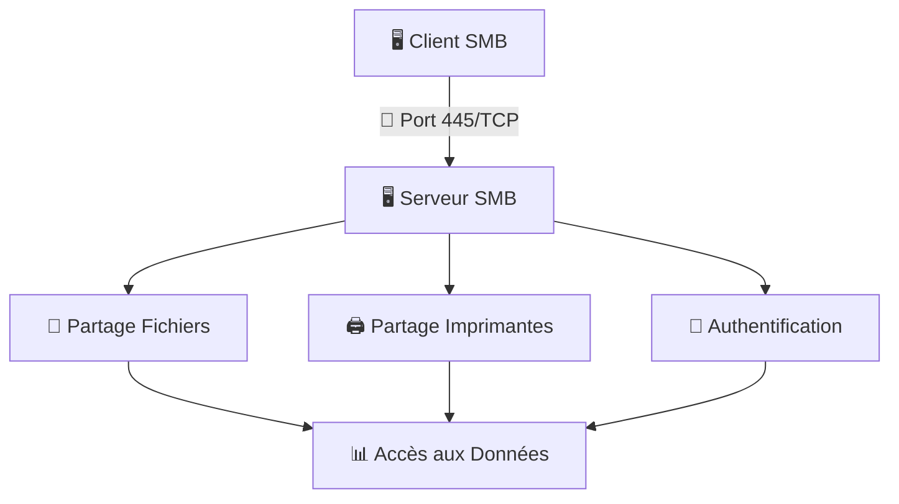
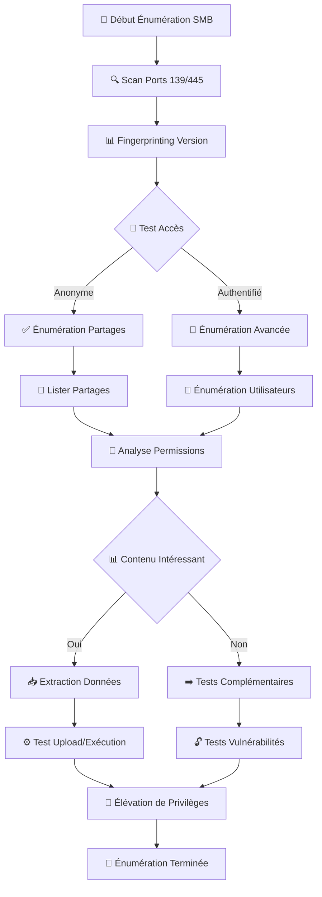

```markdown
---
layout: post
title: "Énumération SMB : Guide Complet"
date: 2025-11-20
categories: tutorial
image: /assets/images/smb.jpg
comments: 8
---

# 🖥️ Énumération SMB : Guide Complet

---

## 🎯 Introduction au Protocole SMB

**Server Message Block (SMB)** est un protocole client-serveur permettant :

* L'accès aux **fichiers**, **répertoires** et **imprimantes** partagés
* La communication inter-processus réseau  
* La compatibilité entre **Windows**, **Linux** et **Unix** via **Samba**



💡 **Note :** SMB fonctionne principalement sur **TCP/445** et historiquement via NetBIOS (**ports 137-139**).

---

## 📚 Historique & Versions SMB

### 🕰️ Évolution des Versions

| Version | OS / Support | Caractéristiques Principales |
|---------|--------------|------------------------------|
| **CIFS** | Windows NT 4.0 | Via NetBIOS |
| **SMB 1.0** | Windows 2000 | Connexion directe TCP |
| **SMB 2.0** | Vista / 2008 | Cache, performances améliorées |
| **SMB 2.1** | 7 / 2008 R2 | Verrouillage amélioré |
| **SMB 3.0** | 8 / 2012 | Multicanaux, chiffrement |
| **SMB 3.1.1** | 10 / 2016 | AES-128, intégrité renforcée |

⚠️ **Attention :** Les anciennes versions (**SMBv1, CIFS**) sont vulnérables (WannaCry, EternalBlue).

---

## 🔧 Comprendre Samba

### 🐧 Samba sous Linux/Unix
* Implémente **SMB/CIFS** pour les systèmes Unix/Linux
* Peut agir comme **membre** ou **contrôleur de domaine Active Directory**
* Composants principaux :

| Démon | Fonction |
|-------|----------|
| `smbd` | Partage de fichiers et imprimantes |
| `nmbd` | Support NetBIOS et résolution de noms |
| `winbindd` | Intégration Active Directory |

---

## ⚙️ Configuration Samba (smb.conf)

### 📝 Exemple de Configuration Minimal

```ini
[global]
   workgroup = DEV.INFREIGHT.hs
   server string = DEVSMB
   map to guest = bad user
   usershare allow guests = yes

[notes]
   comment = CheckIT
   path = /mnt/notes/
   browseable = yes
   writable = yes
   guest ok = yes
   create mask = 0777
   directory mask = 0777
```

### 🔄 Redémarrage du Service
```bash
sudo systemctl restart smbd nmbd
sudo systemctl status smbd
```

---

## 🔍 Phase 1 : Découverte et Scan

### 🎯 Scan de Base avec Nmap
```bash
# Scan des ports SMB
nmap -p139,445 192.168.1.100

# Détection de version et scripts par défaut
nmap -sV -sC -p139,445 192.168.1.100

# Scan agressif avec tous les scripts SMB
nmap --script "smb*" -p139,445 192.168.1.100
```

### 🛠️ Scripts NSE Spécialisés SMB
```bash
# Énumération des partages
nmap --script smb-enum-shares -p139,445 192.168.1.100

# Énumération des utilisateurs
nmap --script smb-enum-users -p139,445 192.168.1.100

# Détection de vulnérabilités
nmap --script smb-vuln* -p139,445 192.168.1.100

# Scan complet
nmap --script "smb-enum-*,smb-vuln-*,smb-os-discovery" -p139,445 192.168.1.100
```

---

## 📊 Phase 2 : Énumération des Partages

### 🔓 Énumération avec smbclient
```bash
# Lister les partages (session nulle)
smbclient -N -L //192.168.1.100

# Connexion à un partage spécifique
smbclient //192.168.1.100/notes -N

# Avec authentification
smbclient //192.168.1.100/notes -U username%password
```

### 💡 Commandes Essentielles smbclient

| Commande | Description | Exemple |
|----------|-------------|---------|
| `ls` | Lister les fichiers | `ls -la` |
| `cd` | Changer de dossier | `cd documents` |
| `get` | Télécharger | `get secret.txt` |
| `put` | Uploader | `put shell.php` |
| `mget` | Téléchargement multiple | `mget *.txt` |
| `mput` | Upload multiple | `mput *` |
| `!command` | Commande locale | `!ls -la` |
| `pwd` | Chemin actuel | `pwd` |

---

## 👥 Phase 3 : Énumération des Utilisateurs

### 🔬 Avec rpcclient
```bash
# Connexion anonyme
rpcclient -U "" 192.168.1.100

# Avec authentification
rpcclient -U "username%password" 192.168.1.100
```

### 📋 Commandes rpcclient Essentielles

| Commande | Description | Sortie Type |
|----------|-------------|-------------|
| `srvinfo` | Informations serveur | Version OS |
| `enumdomains` | Domaines disponibles | Liste domaines |
| `enumdomusers` | Utilisateurs du domaine | Liste users/RID |
| `queryuser <RID>` | Détails utilisateur | Info détaillée |
| `netshareenumall` | Tous les partages | Liste partages |
| `getdompwinfo` | Politique mot de passe | Policy info |

### 📝 Exemple d'Énumération Utilisateur
```bash
rpcclient $> enumdomusers
user:[mrb3n] rid:[0x3e8]
user:[cry0l1t3] rid:[0x3e9]

rpcclient $> queryuser 0x3e9
User Name   : cry0l1t3
Home Drive  : \\devsmb\cry0l1t3
Profile Path: \\devsmb\cry0l1t3\profile
Password last set Time : 22 Sep 2021
```

---

## 🚀 Phase 4 : Outils Avancés

### ⚡ CrackMapExec (CME)
```bash
# Énumération basique
crackmapexec smb 192.168.1.100

# Énumération des partages
crackmapexec smb 192.168.1.100 --shares

# Énumération des utilisateurs
crackmapexec smb 192.168.1.100 --users

# Brute-force
crackmapexec smb 192.168.1.100 -u users.txt -p passwords.txt
```

### 🔍 smbmap
```bash
# Énumération des partages
smbmap -H 192.168.1.100

# Avec authentification
smbmap -H 192.168.1.100 -u username -p password

# Énumération récursive
smbmap -H 192.168.1.100 -u username -p password -r
```

---

## 🛡️ Phase 5 : Tests de Sécurité

### 🔐 Test d'Authentification
```bash
# Test avec des credentials null
smbclient -N -L //192.168.1.100

# Test avec guest account
smbclient -U guest% -L //192.168.1.100

# Brute-force avec Hydra
hydra -L users.txt -P passwords.txt smb://192.168.1.100
```

### 📊 Vérification des Vulnérabilités
```bash
# Scan des vulnérabilités SMB
nmap --script smb-vuln-ms17-010 -p445 192.168.1.100

# Vérification SMBv1
nmap --script smb-protocols -p445 192.168.1.100

# Test EternalBlue
nmap --script smb-vuln-ms17-010 --script-args unsafe=1 192.168.1.100
```

---

## 📋 Checklist de Sécurité SMB

### ✅ Points à Vérifier Systématiquement

```bash
# 1. Accès anonyme
smbclient -N -L //192.168.1.100

# 2. Partages sensibles accessibles
smbmap -H 192.168.1.100

# 3. Utilisateurs énumérables
rpcclient -U "" 192.168.1.100 -c "enumdomusers"

# 4. Vulnérabilités connues
nmap --script smb-vuln* -p445 192.168.1.100

# 5. Version SMB
nmap --script smb-protocols -p445 192.168.1.100
```

### ⚠️ Bonnes Pratiques de Sécurisation

| Pratique | Recommandation |
|----------|----------------|
| 🔐 **SMBv1** | Désactiver complètement |
| 📝 **Authentification** | Mot de passe complexes requis |
| 🔒 **Chiffrement** | Activer SMB signing |
| 👥 **Permissions** | Principe du moindre privilège |
| 📊 **Monitoring** | Journaliser les accès SMB |

---

## 🎯 Workflow d'Énumération Complet



---

## 🚀 Cheatsheet Rapide SMB

### ⚡ Commandes Essentielles en Pentest

```bash
# 🎯 SCAN RAPIDE
nmap -p445 --script smb-enum-shares,smb-enum-users 192.168.1.100

# 🔓 TEST ACCÈS ANONYME
smbclient -N -L //192.168.1.100

# 📁 EXPLORATION PARTAGES
smbclient //192.168.1.100/partage -N

# 👥 ÉNUMÉRATION UTILISATEURS
rpcclient -U "" 192.168.1.100 -c "enumdomusers"

# 🛠️ OUTIL COMPLET
crackmapexec smb 192.168.1.100 --shares --users

# 🔐 TEST CREDENTIALS
smbclient //192.168.1.100/partage -U user%pass

# 📊 VULNÉRABILITÉS
nmap --script smb-vuln* -p445 192.168.1.100
```

### 🎪 Session smbclient Type
```bash
smb: \> ls
  .                                   D        0  Wed Nov 20 10:30:00 2025
  ..                                  D        0  Wed Nov 20 10:30:00 2025
  secret.txt                          N      123  Wed Nov 20 10:30:00 2025
  backup.zip                          N     2048  Wed Nov 20 10:30:00 2025

smb: \> get secret.txt
getting file \secret.txt of size 123 as secret.txt (0.1 KiloBytes/sec)

smb: \> put shell.php
putting file shell.php as \shell.php (0.1 kb/s)
```

---

## 🎓 Conclusion

L'énumération SMB est une compétence fondamentale en test de pénétration, permettant d'identifier les partages non sécurisés, les utilisateurs énumérables et les vulnérabilités critiques.

**Rappel important :** Utilisez ces techniques uniquement dans un cadre légal et éthique, avec autorisation explicite.

---
*Dernière mise à jour : 20 novembre 2025*  
*Catégorie : Pentest / Sécurité réseau*

<!-- Mermaid Setup -->
<div id="mermaid-setup"></div>

<script>
// Charger Mermaid si non présent
(function() {
    function initMermaid() {
        mermaid.initialize({
            startOnLoad: true,
            theme: 'default',
            securityLevel: 'loose'
        });
        mermaid.init(undefined, document.querySelectorAll('.language-mermaid'));
    }

    if (typeof mermaid === 'undefined') {
        const script = document.createElement('script');
        script.src = 'https://cdn.jsdelivr.net/npm/mermaid@10.6.1/dist/mermaid.min.js';
        script.onload = initMermaid;
        document.head.appendChild(script);
    } else {
        initMermaid();
    }
})();
</script>

<style>
.language-mermaid {
    background: linear-gradient(135deg, #667eea 0%, #764ba2 100%) !important;
    border-radius: 15px !important;
    padding: 30px !important;
    margin: 30px 0 !important;
    text-align: center;
    display: block;
}
.language-mermaid pre {
    background: transparent !important;
    margin: 0 !important;
}
</style>
```
